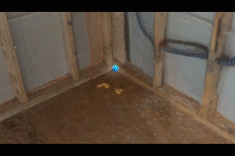
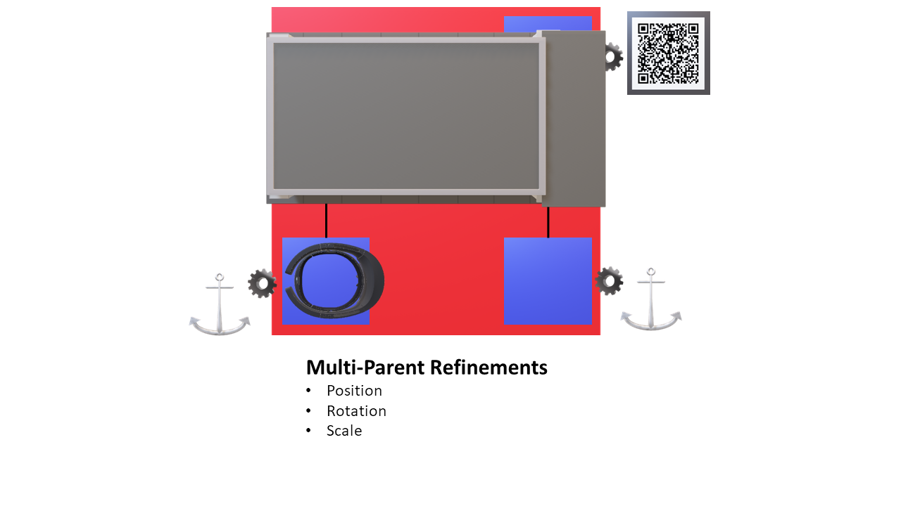
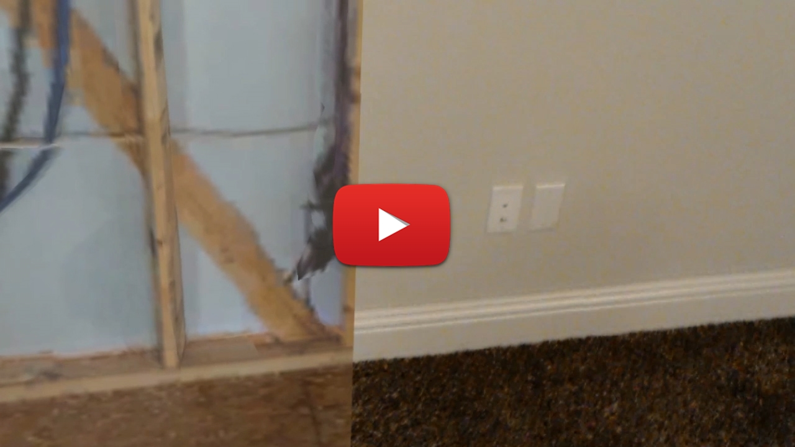
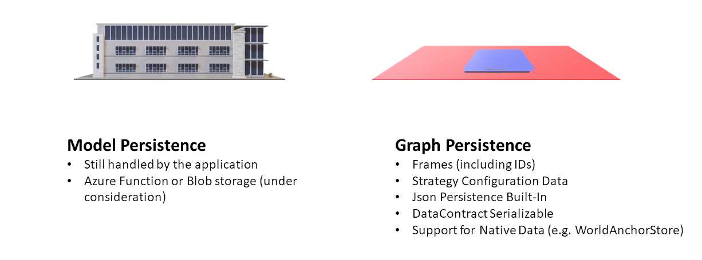

# Spatial Alignment for Unity

This reference architecture includes many helpful components for aligning and keeping virtual objects aligned with the physical world.

### Release 1.1

Release 1.1 contains the following capabilities:

#### Spatial Frames

*Spatial Frames* represent "islands" in the real world. They have a position and a rotation and are designed to hold objects. They also have unique IDs and are available from the moment the application loads (even before they're found in the real world). This simplifies application logic because objects can be loaded up front and automatically aligned when the frame is found. 
 

##### Alignment Strategies

Each *Spatial Frame* has an *Alignment Strategy*. The strategy is what moves the frame and keeps it aligned in the physical world. Alignment Strategies are "plugins", and developers can easily create their own strategies. Developers are also free to mix and match various strategies in the same application.
 

Alignment Strategies provide information about their state (e.g. whether they've been found) and their accuracy (maximum drift in meters). Applications can use this information to make intelligent decisions about which frames are best to contain which objects. In fact, one of the included alignment strategies is a *Multi-Parent* strategy that allows objects to automatically "hop" parent frames based on their state and accuracy.   

#### Refinement

Two of the biggest challenges that accompany spatial alignment are:

1.  Initial placement (and rotation) of objects to match up with the physical world
2.  Accounting for drift that accumulates over distance (a challenge that is present in all large-scale tracking systems)

This reference architecture includes components to help address both. To help with accurate alignment, an extensible system of *Refinement Controllers* is provided. Release 1.1 ships with two refinement controllers in the box: 

- **RayRefinement** - Aligns a virtual model to a physical place by selecting corresponding origin points and directions.

- **NudgeRefinement** - Allows the user to manually "nudge" the virtual model into the correct position and rotation using a stylable 3D D-Pad controller.

To help compensate for drift, *Multi-Parent* alignment offers the ability to apply different positional and rotational offsets at each parent.

The offset ability can be used together with a *Refinement Controller* to bring large-scale models back into alignment when viewed from different locations. 

The video below demonstrates using **RayRefinement** to align a [Matterport 3D](https://matterport.com/) scan of a building with the actual building and keep that scan in alignment from different locations.

#### Persistence

Applications that leverage spatial alignment generate a notable amount of configuration data:

- All of the Frames and their IDs
- All of the configuration settings for each Alignment Strategy
- Relationships between Frames (e.g. Multi-Parent alignment)
- Position, Rotation and Scale offsets
- State requirements (e.g. Resolved, Tracking)
- Accuracy requirements
- etc.

To help applications save all of this data, every component in the architecture is serializable. In fact, the included class **JsonStore** can be used to serialize an entire alignment "graph" into json, which can then be loaded back the next time the application runs.

#### Examples

Release 1.1 includes the following example scenes:

- **SA-MultiParent** - Demonstrates "hopping" between multiple parent spheres in the scene.
- **SA-Persistence** - Demonstrates saving an entire "graph" of frames and their strategies into memory then loading them back into the scene.
- **SA-Refinement** - Demonstrates using **RayRefinement** to place a multi-colored cube in a room.
- **SA-RefinementBuilding** - Demonstrates using **RayRefinement** and **NudgeRefinement** to align a Matterport 3D scan to room. (This example is shown in the video above).

### Contributing

This project has adopted the [Microsoft Open Source Code of Conduct](https://opensource.microsoft.com/codeofconduct/). 
For more information see the [Code of Conduct FAQ](https://opensource.microsoft.com/codeofconduct/faq/) or contact [opencode@microsoft.com](mailto:opencode@microsoft.com) with any additional questions or comments.
