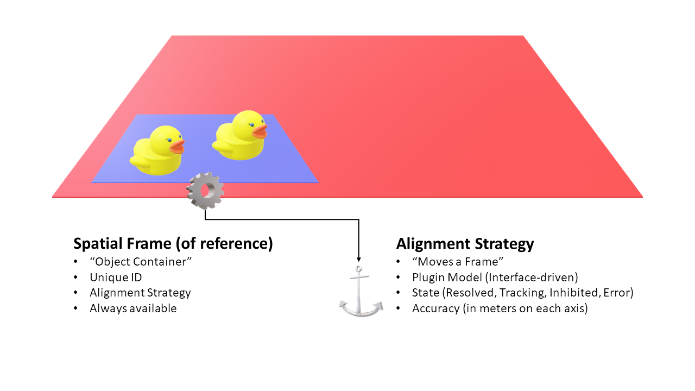
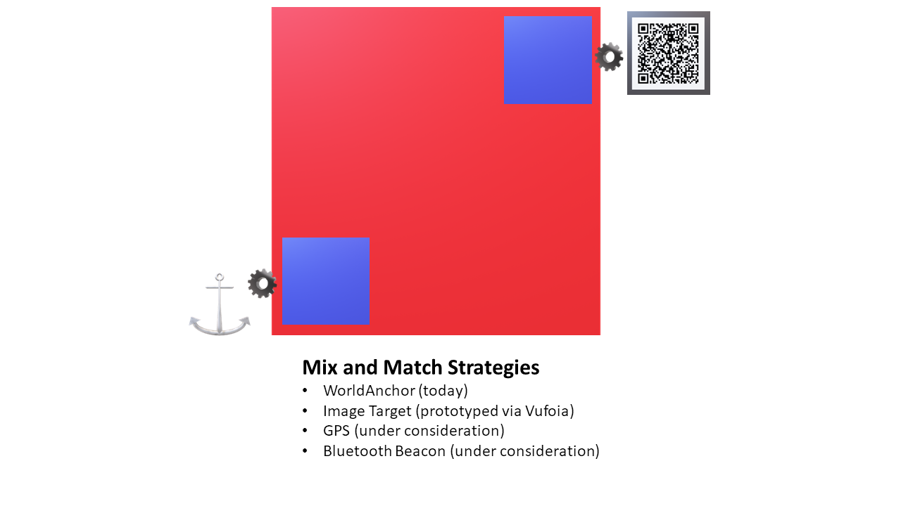
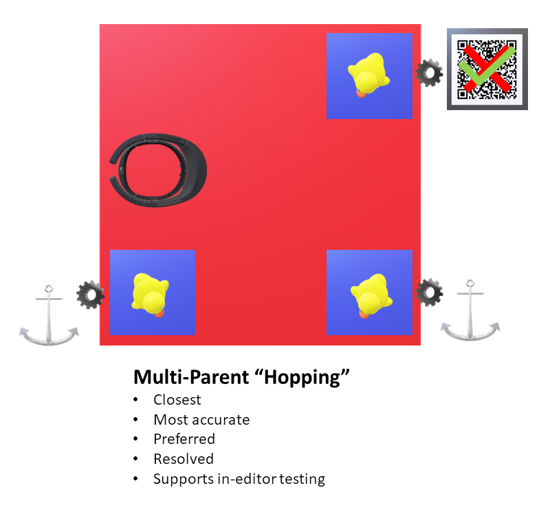

# Spatial Alignment for Unity
This reference architecture includes many helpful components for aligning and keeping virtual objects aligned with the physical world.

### Release 1.0
Release 1.0 contains the following capabilities:

##### Spatial Frames
*Spatial Frames* represent "islands" in the real world. They have a position and a rotation and are designed to hold objects. They also have unique IDs and can be available from the moment the application loads (even before they're found in the real world). This simplifies application logic because objects can be loaded up front and automatically aligned when the frame is found. 
 

##### Alignment Strategies
Each *Spatial Frame* has an *Alignment Strategy*. The strategy is what moves the frame and keeps it aligned in the physical world. Alignment Strategies are "plugins", and developers can easily create their own strategies. Applications are free to mix and match various strategies in the same application.
 

Alignment Strategies provide information about their state (e.g. whether they've been found) and their accuracy (maximum drift in meters). Applications can then use this information to make intelligent decisions about the best frames to use contain objects. In fact, one of the included strategies is a *Multi-Parent* strategy that allows objects to automatically "hop" parent frames based on their state and accuracy.   

##### Refinement
Two of the greatest challenges with spatial alignment are:

1.  Initial placement (and rotation) of objects to match up with the physical world
2.  Accounting for drift that accumulates over distance (a challenge that is present in all large-scale tracking systems)

This reference architecture includes components to help address both. To help with accurate alignment, an extensible system of *Refinement Controllers* is provided. In version 1.0 there is one refinement controller included called **RayRefinement**. **RayRefinement** allows a virtual model and a physical space to be aligned by selecting the corresponding origin points and a direction.

**TODO: RayRefinement Video**    

##### Persistence

##### Examples

This project has adopted the [Microsoft Open Source Code of Conduct](https://opensource.microsoft.com/codeofconduct/). 
For more information see the [Code of Conduct FAQ](https://opensource.microsoft.com/codeofconduct/faq/) or contact [opencode@microsoft.com](mailto:opencode@microsoft.com) with any additional questions or comments.
